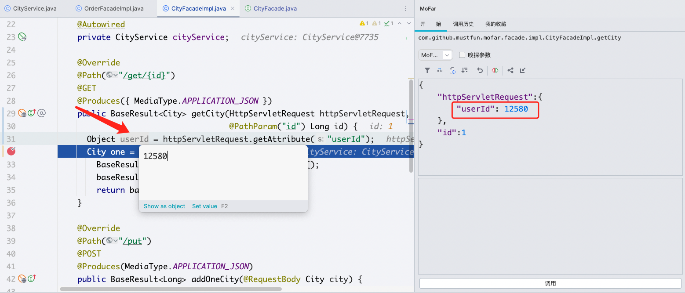
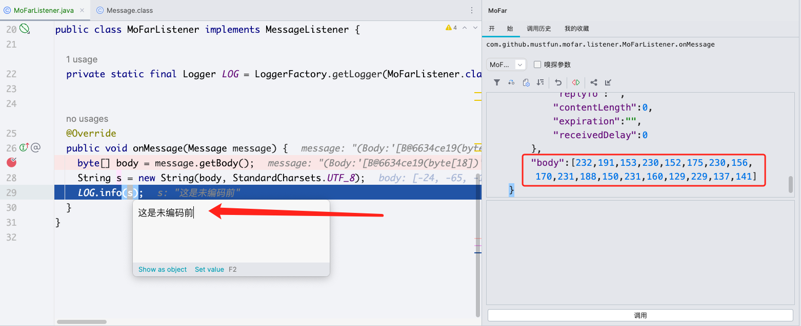
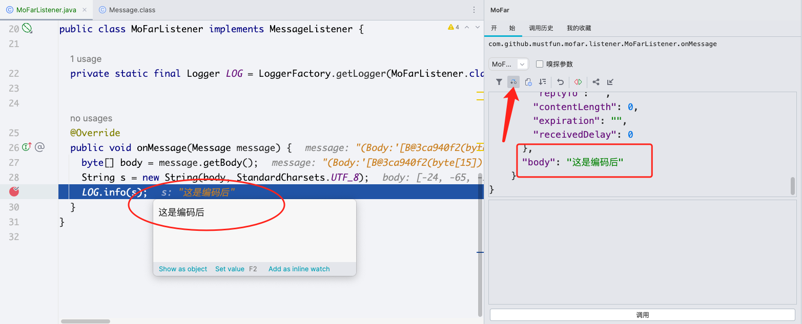
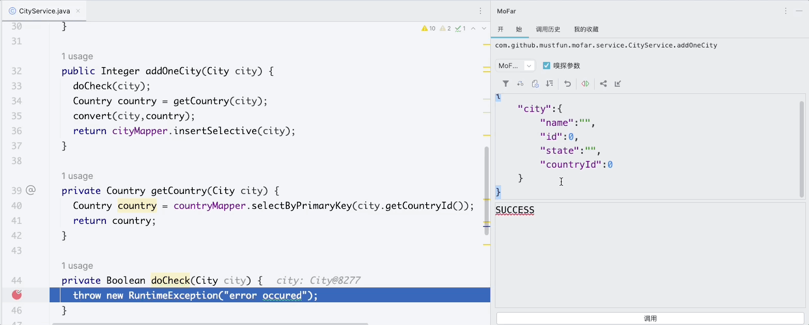

# 1. 进阶技巧

- 本文将介绍MoFar更高级使用特性

## 1.1 发起Http请求 

可以看到自定义的userId参数已经被设置到 httpRequest的 attribute中，可以拿到直接用，就不用构建大量复杂的http请求参数了

## 1.2 字节文本转化

针对Mq这种字节类型的入参，使用起来是很不方便的，比如下图中，RabbitMq的Message类中，包含了字节数组这样的一个对象，使用过程中，需要我们将 JSON字符串转为字节数组填充到入参框中，使用不是很方便

为了解决这个问题，可以点击 工具类 **转换器 ** 按钮

## 1.4 嗅探参数

当入参比较复杂的时候，比如图中的 addOneCity这个方法，City参数比较多的时候，这个时候我们可以采用嗅探参数的方法，自动捕获参数。

- 先把嗅探参数开关打开 - 提示SUCCESS的时候表示为打开成功
- 当有请求来的时候，自动填充参数栏

这对于一些比较复杂的入参特别有用，比如Mq消息

## 

## 1.5 使用Http协议发起请求

## 