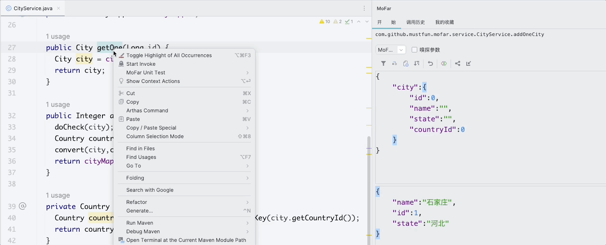
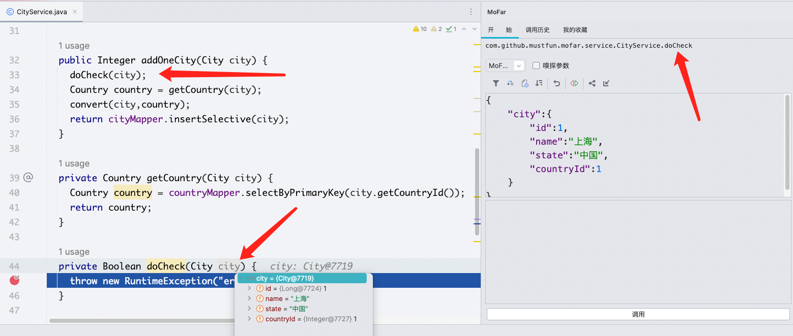
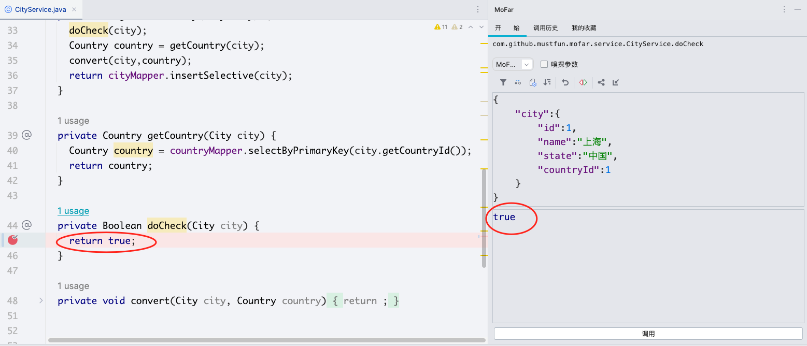
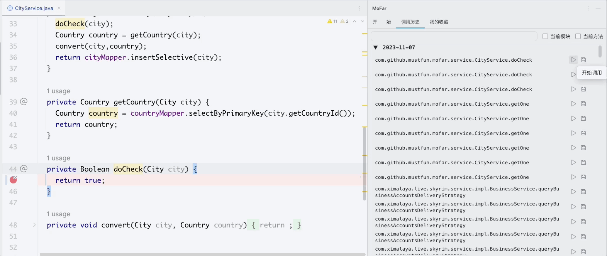

# 1. 背景

- 作者作为一名普通的小小开发，每次启动公司项目，少则90s ，多则180s , 每次调试一个小功能，启用spring-test，每次基本要耗费很长时间，即使只是改了很小一部分代码，**无疑是浪费生命在等待项目启动上**
- 如何能更快的调试和测试我们写的代码呢，本项目应运而生

## 1.1 介绍

MoFar是一款IDEA插件，插件的形式嵌入在IDE里面，不用切换界面即可对自己写的代码进行调试，不用重启项目即可对更新的代码进行调试。加快测试代码效率，用下面一张图可能能让你更快理解。

注： 如果你是调试模式开启的应用，即可实现调试了

# 2. 功能特性

## 2.1 模块化调试

在我们开发的时候，经常需要调试代码，或者测试提了某bug ， 如果走全流程非常麻烦，如果更快的定位某个问题呢，能否只测试抛出异常的一段代码呢

如下图，业务代码 ``addOneCity`` 发生异常了，前面还有很复杂的业务逻辑，但是异常抛在了`doCheck`方法，如何快速定位呢，只需要对`doCheck`方法进行右键，选中`start invoke`即可调试`doCheck`方法了

注：`doCheck`方法所需要的参数，只需要填一次即可，下次会自动填充， 系统会记录你的参数

## 2.2 实时生效

本功能依赖于IDEA 热部署功能，当修改完代码之后，IDEA菜单栏`  Build ->Recompile CityService.java`  或者快捷键 `ctrl+shift+F9`（Windows）即可热部署完成，可以看到在不重启应用的情况下，点击调用，实时生效，发现代码已经可以返回true了

## 2.3 调用历史

调用历史，针对已经发起过的调用，可以直接从历史发起，方便快捷

## 2.4 收藏夹

针对比较重要的接口，每天都在见到的接口，可直接加入到收藏夹里面即可

- 优先级不高，暂未开发
