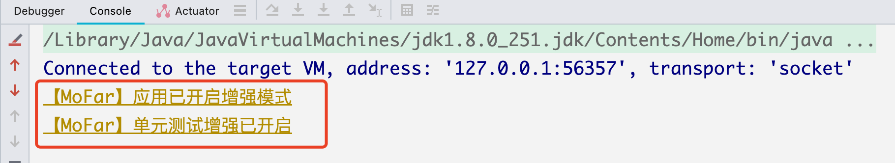

# 1. 快速开始

## 1.1 下载安装

 **➤**   离线安装

- 前往jetbrains插件平台  <a href="https://plugins.jetbrains.com/plugin/20620-mofar" target="_blank">平台地址</a>
- 点击右侧GET按钮 ，选择适合自己版本的插件版本，点击download
- 下载保存后拖动到IDEA，重启即可
  - 这里部分小伙伴会报错，注意下载跟自己IDE匹配的版本即可，如果依然报错请选择在线安装

 **➤**   在线安装 

- 打开IDEA

  - 菜单栏 ➜ Preferences ➜ Plugins ➜ Marketplace
  - 搜索MoFar 安装即可

  

  

如果您依然不能安装，请进群留言您的IDE版本，我会尽快适配

# 2. 配置

使用MoFar无需额外的配置，会自动匹配你当前启动的Web容器 （tomcat/jetty/undertow等容器），如果某些场景需要关闭MoFar ，可以前往IDEA配置界面，关闭。如下图：

# 3.使用

## 3.1 基础

MoFar目前只支持Spring应用，点击启动、或者调试应用按钮，如下图

Console里面看到这两行日志说明MoFar自动配置完成

看到下面这行日志说明项目启动完成，MoFar注入完成

## 3.2 开始调试

对你需要调试的方法右键，选择`start test`  , MoFar窗口便会自动打开.

MoFar会自动解析该方法所需要的参数，只需要填入值，然后点击调用，即可发起调试了

- 有字段不需要设值可填`null` , 或者把这个字段删掉即可

## 3.2 进阶技巧

- 通过对右侧MoFar SideBar右键，可以调整插件大小，位置，视图模式等，非常方便，如下图，置为飘浮状态，不影响开发，调用起来也方便

